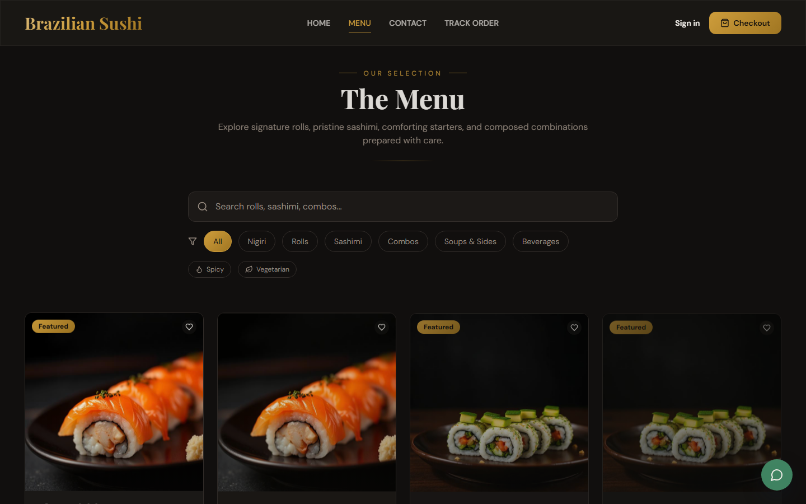
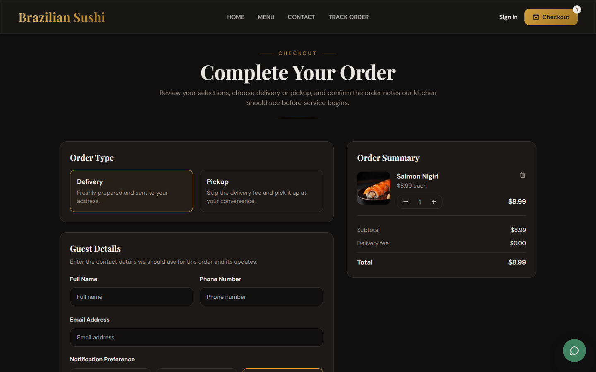
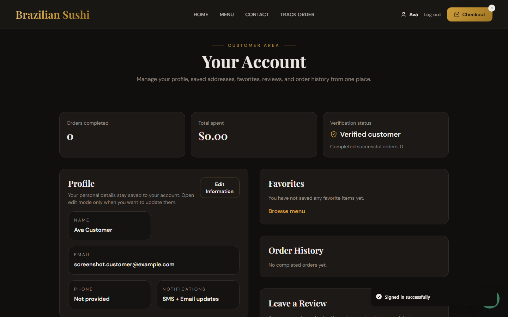
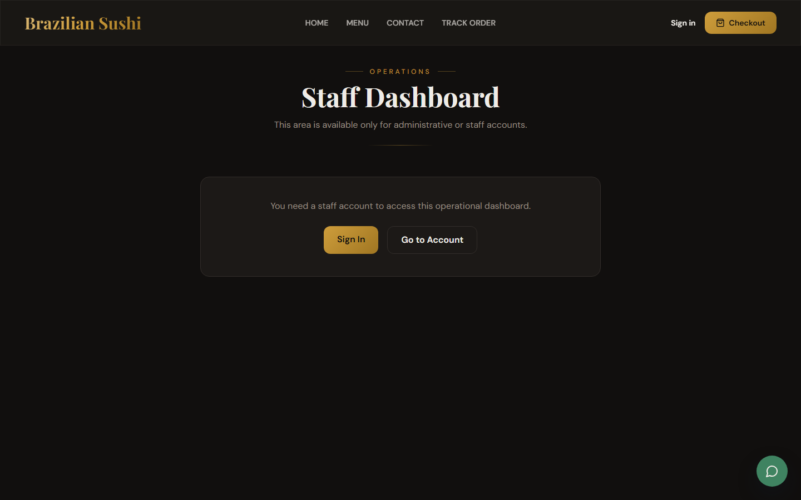

# Brazilian Sushi

<p align="center">
  
  
  
  
  
  
  
  
  
</p>

<p align="center">
  
  
</p>

<p align="center">
  Premium sushi delivery and takeout platform built as a realistic fullstack portfolio project for the U.S. market, combining a polished storefront, production-minded backend, customer accounts, order tracking, promotions, staff operations, and real payment processing.
</p>

<p align="center">
  <strong>Live Demo:</strong><br />
  <a href="https://brazilian-sushi.vercel.app">
    
  </a>
</p>

## 🍣 About The Project

Brazilian Sushi was designed as a premium restaurant ordering experience focused on delivery and pickup. The product balances refined branding, conversion-oriented UX, and operational practicality, covering the customer journey from menu browsing to checkout, payment, tracking, account management, and staff-side order handling.

The project was intentionally built to stay realistic and interview-friendly: modern frontend architecture, a clean Django API, defense-in-depth security decisions, automated tests at every layer, and a feature set that feels credible for a professional portfolio without unnecessary enterprise complexity.

## ✨ Key Features

### 🛍️ Ordering Experience

- Premium home page with featured items, promotions, reviews, business highlights, and clear conversion paths
- Searchable menu with categories, combos, favorites, dietary and allergen labels, and add-to-cart flow
- Checkout flow with delivery or pickup, guest ordering, allergy notes, special instructions, and notification preferences
- Optional Stripe Checkout payment step — priced entirely server-side from the order that was just created
- Secure guest order tracking through a tracking token
- Customer account with saved addresses, favorites, order history, profile settings, and review submission for verified customers

### 🧑‍🍳 Restaurant Operations

- Django admin plus a custom staff dashboard for queue visibility, quick status updates, and a 7-day revenue chart
- Order lifecycle support across received, confirmed, preparing, ready, out for delivery, and delivered states
- Verified customer controls tied to loyalty and operational workflows
- Review moderation, promotions, coupons, and contact-message handling
- Health endpoint and production-ready environment setup for deployment verification

### 🔐 Security

- Every write to an order's price, status, or payment state goes through a permission-checked, audited action — the public order endpoint cannot be used to rewrite them directly
- Rate limiting on authentication endpoints (login, register, resend confirmation) via DRF throttling
- The app refuses to boot with `DEBUG=False` unless a real `SECRET_KEY` and `ALLOWED_HOSTS` are configured, instead of running exposed
- Content-Security-Policy, Referrer-Policy, and Permissions-Policy headers on both the API (Django middleware) and the static frontend (`vercel.json`)
- Automatic, silent access-token refresh on the frontend so a session never dies mid-checkout
- Optional Sentry error monitoring, off by default, on for both API and frontend when a DSN is configured

### 🚀 SEO and Production Readiness

- Route-aware metadata strategy for public and private pages
- `robots.txt`, `sitemap.xml`, and `site.webmanifest`
- Noindex strategy for checkout, account, tracking, auth, and staff pages
- Custom favicon configured in `public/favicon.ico`
- Vercel deployment with Django API support and PostgreSQL-backed production setup
- CI on every push/PR: frontend lint + unit tests + build, backend checks + tests
- OpenAPI schema and Swagger UI generated directly from the API (`drf-spectacular`)

## 📸 Application Screenshots







## 🛠 Technology Stack

### Frontend

- React
- TypeScript
- Vite
- Tailwind CSS
- shadcn/ui
- TanStack Query
- React Router
- Framer Motion
- Recharts (staff revenue chart)

### Backend

- Django
- Django REST Framework
- Simple JWT
- Stripe (Checkout + webhooks, optional)
- drf-spectacular (OpenAPI schema / Swagger UI)
- PostgreSQL with Neon in production
- SQLite for local development

### Testing

- Vitest + Testing Library (frontend unit tests)
- Playwright (end-to-end: guest checkout, authenticated login)
- Django `TestCase` / DRF `APITestCase` (backend unit and integration tests)

### Deployment

- Vercel
- Neon PostgreSQL
- GitHub Actions (CI)

## ⚙️ Local Setup

### 1. Clone the repository

```bash
git clone https://github.com/GugaValenca/BRAZILIAN-SUSHI.git
cd BRAZILIAN-SUSHI
```

### 2. Install frontend dependencies

```bash
npm install
```

### 3. Install backend dependencies

```bash
pip install -r requirements.txt
```

### 4. Create the local environment file

```bash
cp .env.example .env
```

On Windows PowerShell:

```powershell
Copy-Item .env.example .env
```

All values in `.env.example` are safe local defaults. Stripe and Sentry are entirely optional — leave those variables blank and the app runs exactly as if they didn't exist. See [Environment variables](#-environment-variables) below for what each one does.

### 5. Run migrations and seed the menu

```bash
python manage.py migrate
python manage.py seed_brazilian_sushi
```

## ▶️ Running The Project

### Frontend

```bash
npm run dev:frontend
```

Frontend URL: `http://127.0.0.1:8080`

### Backend

```bash
npm run dev:backend
```

Backend URL: `http://127.0.0.1:8010`

Health check: `http://127.0.0.1:8010/api/health/`
API docs (Swagger UI): `http://127.0.0.1:8010/api/schema/swagger-ui/`

### Validation

```bash
npm run lint
npm run test
npm run build
npm run check:backend
npm run test:backend
```

### End-to-end tests

Playwright drives real browser flows (guest checkout, login) against the app running locally. It starts both dev servers itself:

```bash
npx playwright install chromium   # first time only
npm run test:e2e
```

## 🔑 Environment variables

Every variable lives in `.env.example` with a safe default. The notable groups:

| Variable | Required? | Purpose |
| --- | --- | --- |
| `DJANGO_SECRET_KEY` | **Yes in production** | Signs sessions and JWTs. The app refuses to start with `DEBUG=False` and the default value. |
| `DJANGO_DEBUG`, `DJANGO_ALLOWED_HOSTS` | Yes in production | Standard Django production hosts/debug config. |
| `DATABASE_URL` / `DB_*` | No (defaults to SQLite) | PostgreSQL connection for production (Neon). |
| `TWILIO_*`, `EMAIL_*` | No | Account confirmation via SMS/email. Falls back to console email in dev. |
| `STRIPE_SECRET_KEY`, `STRIPE_PUBLISHABLE_KEY`, `STRIPE_WEBHOOK_SECRET` | No | Enables real Stripe Checkout on order creation. Blank = checkout works exactly as before, no payment step. |
| `DJANGO_SENTRY_DSN`, `VITE_SENTRY_DSN` | No | Enables error monitoring for the API and the frontend respectively. |

## 🧱 Project Structure

```text
.
|-- accounts/          # Users, addresses, favorites, JWT auth
|-- api/                # Vercel/WSGI entrypoints
|-- backend/            # Django project settings, security middleware, root urls
|-- e2e/                # Playwright end-to-end specs
|-- docs/
|   |-- screenshots/
|-- marketing/          # Promotions, coupons, reviews, contact messages
|-- menu/               # Categories, items, options
|-- orders/              # Orders, order services (business logic), delivery zones
|-- payments/            # Stripe Checkout + webhook (optional)
|-- public/
|-- src/
|   |-- components/
|   |-- contexts/
|   |-- hooks/
|   |-- lib/
|   |-- pages/
|-- .github/workflows/  # CI
|-- manage.py
|-- package.json
|-- requirements.txt
|-- vercel.json
```

## 🧠 Technical Highlights

- Built a realistic fullstack ordering flow with clear separation between storefront, customer account, and staff operations
- Applied defense-in-depth security: server-computed pricing, an allow-list of writable order fields *and* a disabled generic write route on top of it, rate-limited auth, and a fail-fast production config check
- Kept payments strictly opt-in and additive — Stripe Checkout activates only when configured, with zero behavior change otherwise, the same pattern already used for SMS/email
- Designed a portfolio-ready product that stays explainable in interviews while still covering meaningful business workflows
- Strengthened production readiness with CI, OpenAPI docs, optional error monitoring, and PostgreSQL-backed configuration

## 🤝 Contributing

This repository is maintained as a portfolio project, but thoughtful suggestions and improvements are welcome through issues or pull requests.

## 📄 License

This project is available under the [MIT License](LICENSE).

## 📬 Contact

**Gustavo Valença**

[](https://github.com/GugaValenca)
[](https://www.linkedin.com/in/gugavalenca/)
[](https://www.instagram.com/gugatampa)
[](https://www.twitch.tv/gugatampa)
[](https://discord.com/invite/3QQyR5whBZ)
